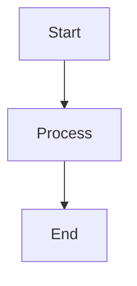

# Tavily Register Documentation

This directory contains the comprehensive documentation system for Tavily Register, built with MkDocs and Material theme.

## 📚 Documentation Structure

```
docs/
├── index.md                    # Main documentation homepage
├── index.zh.md                 # Chinese homepage
├── getting-started/            # Getting started guides
│   ├── index.md               # Getting started overview
│   ├── installation.md        # Installation instructions
│   ├── quick-start.md         # Quick start guide
│   └── configuration.md       # Configuration guide
├── user-guide/                # User documentation
│   ├── index.md               # User guide overview
│   ├── basic-usage.md         # Basic usage patterns
│   ├── advanced-features.md   # Advanced features
│   ├── email-integration.md   # Email handling
│   └── browser-configuration.md # Browser setup
├── api/                       # API reference
│   ├── index.md               # API overview
│   ├── core.md                # Core modules
│   ├── email.md               # Email modules
│   ├── configuration.md       # Configuration API
│   └── utilities.md           # Utility functions
├── examples/                  # Code examples
│   ├── index.md               # Examples overview
│   ├── basic.md               # Basic examples
│   ├── advanced.md            # Advanced examples
│   └── configurations.md      # Configuration examples
├── troubleshooting/           # Troubleshooting guides
│   ├── index.md               # Troubleshooting overview
│   ├── common-issues.md       # Common problems
│   ├── error-messages.md      # Error reference
│   └── performance.md         # Performance tips
├── development/               # Development guides
│   ├── index.md               # Development overview
│   ├── contributing.md        # Contribution guidelines
│   ├── testing.md             # Testing guide
│   └── release-process.md     # Release process
├── assets/                    # Documentation assets
│   ├── images/                # Images and screenshots
│   ├── stylesheets/           # Custom CSS
│   └── javascripts/           # Custom JavaScript
├── overrides/                 # Theme customizations
├── includes/                  # Reusable content
└── changelog.md               # Project changelog
```

## 🚀 Quick Start

### Local Development

1. **Install dependencies:**
   ```bash
   pip install -e ".[docs]"
   ```

2. **Start development server:**
   ```bash
   python scripts/setup_docs.py serve
   # or
   mkdocs serve
   ```

3. **View documentation:**
   Open http://127.0.0.1:8000 in your browser

### Building Documentation

```bash
# Build static site
mkdocs build

# Build with strict mode (fail on warnings)
mkdocs build --strict

# Clean build
mkdocs build --clean
```

## 🌟 Features

### Modern Design
- **Material Design** theme with responsive layout
- **Dark/Light mode** toggle
- **Mobile-friendly** navigation
- **Search functionality** with instant results

### Enhanced Content
- **Interactive code examples** with copy-to-clipboard
- **Mermaid diagrams** for visual explanations
- **Tabbed content** for multiple options
- **Admonitions** for important information
- **Progress indicators** and reading time

### Multi-language Support
- **English** (default)
- **Chinese** (中文)
- **Automatic language detection**
- **Fallback to default language**

### Developer Experience
- **Live reload** during development
- **Fast search** with offline support
- **Git integration** with edit links
- **Version control** with git revision dates
- **Social sharing** capabilities

## 🔧 Configuration

The documentation is configured in `mkdocs.yml` with:

- **Material theme** with custom colors and features
- **Plugins** for enhanced functionality
- **Extensions** for advanced Markdown features
- **Navigation** structure and organization
- **Search** configuration and optimization

### Key Plugins

- **search**: Advanced search functionality
- **git-revision-date-localized**: Git-based timestamps
- **git-authors**: Author information from git
- **mermaid2**: Diagram support
- **macros**: Template variables and functions
- **include-markdown**: Content inclusion
- **i18n**: Multi-language support

## 📝 Writing Documentation

### Style Guide

1. **Use clear, concise language**
2. **Include practical examples**
3. **Add code snippets** for all features
4. **Use admonitions** for important notes
5. **Keep content up-to-date**

### Markdown Extensions

The documentation supports advanced Markdown features:

```markdown
# Code blocks with syntax highlighting
```python
def example_function():
    return "Hello, World!"
```

# Admonitions
!!! tip "Pro Tip"
    This is a helpful tip for users.

!!! warning "Important"
    This is critical information.

# Tabbed content
=== "Tab 1"
    Content for tab 1

=== "Tab 2"
    Content for tab 2

# Mermaid diagrams

```

### Content Guidelines

#### Code Examples
- **Always test** code examples
- **Include imports** and setup
- **Show expected output**
- **Handle errors** appropriately

#### Screenshots
- **Use consistent** browser/OS
- **Highlight important** areas
- **Keep images** up-to-date
- **Optimize file sizes**

#### Links
- **Use relative links** for internal content
- **Check external links** regularly
- **Provide context** for links
- **Use descriptive** link text

## 🔄 Automation

### CI/CD Integration

Documentation is automatically:

- **Built and tested** on every commit
- **Deployed to GitHub Pages** on main branch
- **Validated for links** and markup
- **Tested for accessibility** and performance

### GitHub Actions

The `.github/workflows/docs.yml` workflow:

1. **Builds documentation** with MkDocs
2. **Validates content** and links
3. **Tests accessibility** with axe-core
4. **Checks performance** with Lighthouse
5. **Deploys to GitHub Pages**

## 🧪 Testing

### Documentation Tests

```bash
# Build test
mkdocs build --strict

# Link checking
linkchecker http://127.0.0.1:8000

# HTML validation
html-validate site/**/*.html

# Accessibility testing
axe http://127.0.0.1:8000

# Performance testing
lighthouse http://127.0.0.1:8000
```

### Content Validation

- **Spell checking** with automated tools
- **Grammar checking** for clarity
- **Code testing** for accuracy
- **Link validation** for reliability

## 🤝 Contributing

### Documentation Contributions

1. **Fork the repository**
2. **Create a feature branch**
3. **Make your changes**
4. **Test locally** with `mkdocs serve`
5. **Submit a pull request**

### Content Guidelines

- **Follow the style guide**
- **Test all examples**
- **Update navigation** if needed
- **Add translations** for new content

### Review Process

All documentation changes go through:

1. **Automated testing** (CI/CD)
2. **Content review** (maintainers)
3. **Technical review** (subject experts)
4. **Final approval** and merge

## 📊 Analytics

The documentation includes:

- **Google Analytics** for usage tracking
- **Performance monitoring** with Core Web Vitals
- **User feedback** collection
- **Search analytics** for content optimization

## 🆘 Support

### Getting Help

- **GitHub Issues**: Report documentation bugs
- **Discussions**: Ask questions about content
- **Email**: Direct contact for urgent issues

### Maintenance

Documentation is maintained by:

- **Core team**: Overall structure and strategy
- **Contributors**: Content updates and improvements
- **Community**: Feedback and suggestions

---

**Built with ❤️ using MkDocs and Material theme**

When updating documentation:
1. Keep examples current and tested
2. Use clear, concise language
3. Include code examples where helpful
4. Update the table of contents when adding new sections
