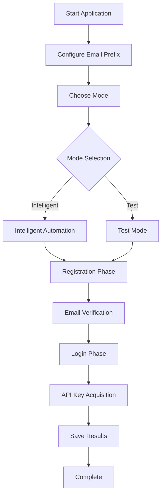

# Tavily Register Documentation

<div align="center">
  
  
  [](https://python.org)
  [](https://github.com/yatotm/tavily-register/blob/main/LICENSE)
  [](https://github.com/psf/black)
  [](https://yatotm.github.io/tavily-register)
</div>

## Welcome to Tavily Register

**Tavily Register** is an intelligent automation solution for Tavily API key registration based on deep HTML analysis. It provides end-to-end automated API key acquisition with high performance and reliability.

## ✨ Key Features

!!! tip "Intelligent Automation"
    Advanced element detection and smart waiting mechanisms for optimal performance

!!! success "High Performance"
    60-70% performance improvement with 95%+ success rate

!!! info "Email Integration"
    Automated email verification and cookie management

!!! gear "Flexible Configuration"
    Support for multiple browser types and modes

!!! shield "Error Handling"
    Robust error handling and recovery mechanisms

!!! chart "Detailed Logging"
    Comprehensive logging and HTML information collection

## 🚀 Quick Start

Get started with Tavily Register in just a few steps:

=== "Installation"

    ```bash
    # Clone the repository
    git clone https://github.com/yatotm/tavily-register.git
    cd tavily-register
    
    # Install dependencies
    pip install -e .[docs]
    
    # Install browser
    playwright install firefox
    ```

=== "Configuration"

    ```python
    # Edit src/tavily_register/config/settings.py
    EMAIL_PREFIX = "your_prefix"  # Replace with your 2925.com email prefix
    ```

=== "Usage"

    ```bash
    # Run the application
    python main.py
    
    # Choose your preferred mode:
    # 1. Intelligent Automation Mode (Recommended)
    # 2. Test Mode (For debugging)
    ```

## 📚 Documentation Structure

<div class="grid cards" markdown>

-   :material-rocket-launch:{ .lg .middle } **Getting Started**

    ---

    Quick installation, configuration, and first steps

    [:octicons-arrow-right-24: Get Started](getting-started/index.md)

-   :material-book-open-page-variant:{ .lg .middle } **User Guide**

    ---

    Comprehensive guides for all features and use cases

    [:octicons-arrow-right-24: User Guide](user-guide/index.md)

-   :material-api:{ .lg .middle } **API Reference**

    ---

    Complete API documentation with examples

    [:octicons-arrow-right-24: API Reference](api/index.md)

-   :material-code-braces:{ .lg .middle } **Examples**

    ---

    Practical examples and code samples

    [:octicons-arrow-right-24: Examples](examples/index.md)

-   :material-help-circle:{ .lg .middle } **Troubleshooting**

    ---

    Solutions for common issues and problems

    [:octicons-arrow-right-24: Troubleshooting](troubleshooting/index.md)

-   :material-hammer-wrench:{ .lg .middle } **Development**

    ---

    Contributing guidelines and development setup

    [:octicons-arrow-right-24: Development](development/index.md)

</div>

## 🔄 How It Works



## 📤 Output Format

API Keys are automatically saved in the `api_keys.md` file:

```text
user123-abc123@2925.com,TavilyAuto123!,tvly-dev-xxxxxxxxxx,2025-01-01 12:00:00;
```

**Format:** `Email,Password,API_Key,Timestamp`

## 🛠️ Tech Stack

- **Python 3.12+** - Modern Python with type hints
- **Playwright** - Reliable web automation
- **BeautifulSoup4** - HTML parsing and analysis
- **pytest** - Comprehensive testing framework

## 🤝 Community & Support

- **GitHub Issues**: [Report bugs and request features](https://github.com/yatotm/tavily-register/issues)
- **Discussions**: [Community discussions and Q&A](https://github.com/yatotm/tavily-register/discussions)
- **Contributing**: [Contribution guidelines](development/contributing.md)

## ⚠️ Important Notice

!!! warning "Usage Disclaimer"
    This tool is for educational and research purposes only. Please comply with the terms of service of relevant websites when using this tool.

## 📄 License

This project is licensed under the MIT License - see the [LICENSE](https://github.com/yatotm/tavily-register/blob/main/LICENSE) file for details.

---

<div align="center">
  <p>Made with ❤️ by the Tavily Register Team</p>
  <p>
    <a href="https://github.com/yatotm/tavily-register">GitHub</a> •
    <a href="https://github.com/yatotm/tavily-register/issues">Issues</a> •
    <a href="https://github.com/yatotm/tavily-register/discussions">Discussions</a>
  </p>
</div>
