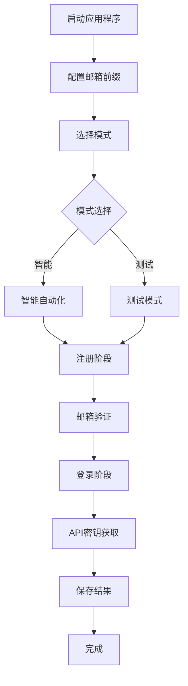

# Tavily Register 文档

<div align="center">
  
  
  [](https://python.org)
  [](https://github.com/yatotm/tavily-register/blob/main/LICENSE)
  [](https://github.com/psf/black)
  [](https://yatotm.github.io/tavily-register)
</div>

## 欢迎使用 Tavily Register

**Tavily Register** 是一个基于深度HTML分析的智能自动化解决方案，用于Tavily API密钥注册。它提供端到端的自动化API密钥获取，具有高性能和可靠性。

## ✨ 核心特性

!!! tip "智能自动化"
    先进的元素检测和智能等待机制，实现最佳性能

!!! success "高性能"
    性能提升60-70%，成功率达95%+

!!! info "邮箱集成"
    自动邮箱验证和Cookie管理

!!! gear "灵活配置"
    支持多种浏览器类型和模式

!!! shield "错误处理"
    强大的错误处理和恢复机制

!!! chart "详细日志"
    全面的日志记录和HTML信息收集

## 🚀 快速开始

只需几个步骤即可开始使用Tavily Register：

=== "安装"

    ```bash
    # 克隆仓库
    git clone https://github.com/yatotm/tavily-register.git
    cd tavily-register
    
    # 安装依赖
    pip install -e .[docs]
    
    # 安装浏览器
    playwright install firefox
    ```

=== "配置"

    ```python
    # 编辑 src/tavily_register/config/settings.py
    EMAIL_PREFIX = "your_prefix"  # 替换为您的2925.com邮箱前缀
    ```

=== "使用"

    ```bash
    # 运行应用程序
    python main.py
    
    # 选择您偏好的模式：
    # 1. 智能自动化模式（推荐）
    # 2. 测试模式（用于调试）
    ```

## 📚 文档结构

<div class="grid cards" markdown>

-   :material-rocket-launch:{ .lg .middle } **快速开始**

    ---

    快速安装、配置和第一步

    [:octicons-arrow-right-24: 开始使用](getting-started/index.md)

-   :material-book-open-page-variant:{ .lg .middle } **用户指南**

    ---

    所有功能和用例的综合指南

    [:octicons-arrow-right-24: 用户指南](user-guide/index.md)

-   :material-api:{ .lg .middle } **API 参考**

    ---

    完整的API文档和示例

    [:octicons-arrow-right-24: API 参考](api/index.md)

-   :material-code-braces:{ .lg .middle } **示例**

    ---

    实用示例和代码样本

    [:octicons-arrow-right-24: 示例](examples/index.md)

-   :material-help-circle:{ .lg .middle } **故障排除**

    ---

    常见问题和解决方案

    [:octicons-arrow-right-24: 故障排除](troubleshooting/index.md)

-   :material-hammer-wrench:{ .lg .middle } **开发**

    ---

    贡献指南和开发设置

    [:octicons-arrow-right-24: 开发](development/index.md)

</div>

## 🔄 工作原理



## 📤 输出格式

API密钥会自动保存在 `api_keys.md` 文件中：

```text
user123-abc123@2925.com,TavilyAuto123!,tvly-dev-xxxxxxxxxx,2025-01-01 12:00:00;
```

**格式：** `邮箱,密码,API密钥,时间戳`

## 🛠️ 技术栈

- **Python 3.12+** - 现代Python与类型提示
- **Playwright** - 可靠的网页自动化
- **BeautifulSoup4** - HTML解析和分析
- **pytest** - 综合测试框架

## 🤝 社区与支持

- **GitHub Issues**: [报告错误和请求功能](https://github.com/yatotm/tavily-register/issues)
- **讨论**: [社区讨论和问答](https://github.com/yatotm/tavily-register/discussions)
- **贡献**: [贡献指南](development/contributing.md)

## ⚠️ 重要声明

!!! warning "使用免责声明"
    此工具仅用于教育和研究目的。使用此工具时请遵守相关网站的服务条款。

## 📄 许可证

本项目采用MIT许可证 - 详情请参阅 [LICENSE](https://github.com/yatotm/tavily-register/blob/main/LICENSE) 文件。

---

<div align="center">
  <p>由 Tavily Register 团队用 ❤️ 制作</p>
  <p>
    <a href="https://github.com/yatotm/tavily-register">GitHub</a> •
    <a href="https://github.com/yatotm/tavily-register/issues">Issues</a> •
    <a href="https://github.com/yatotm/tavily-register/discussions">讨论</a>
  </p>
</div>
