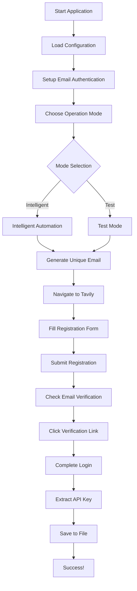

# User Guide

Welcome to the comprehensive user guide for Tavily Register. This section provides detailed instructions for using all features of the automation tool.

## Overview

Tavily Register is designed to automate the complete process of registering for Tavily API keys. The tool handles everything from form filling to email verification, providing a seamless experience for developers who need multiple API keys.

## How It Works



## User Guide Sections

<div class="grid cards" markdown>

-   :material-play-circle:{ .lg .middle } **Basic Usage**

    ---

    Learn the fundamentals of running Tavily Register

    [:octicons-arrow-right-24: Basic Usage](basic-usage.md)

-   :material-cog-outline:{ .lg .middle } **Advanced Features**

    ---

    Explore advanced automation features and customization

    [:octicons-arrow-right-24: Advanced Features](advanced-features.md)

-   :material-email:{ .lg .middle } **Email Integration**

    ---

    Master email verification and authentication

    [:octicons-arrow-right-24: Email Integration](email-integration.md)

-   :material-web:{ .lg .middle } **Browser Configuration**

    ---

    Configure browsers and automation settings

    [:octicons-arrow-right-24: Browser Configuration](browser-configuration.md)

</div>

## Key Features

### 🧠 Intelligent Automation

The intelligent automation mode uses advanced HTML analysis and machine learning techniques to:

- **Detect form elements** automatically
- **Handle dynamic content** and AJAX requests
- **Adapt to website changes** without code updates
- **Optimize performance** with smart waiting strategies

### 📧 Email Management

Comprehensive email handling includes:

- **Automatic email generation** with unique identifiers
- **Real-time inbox monitoring** for verification emails
- **Cookie-based authentication** for persistent sessions
- **Multi-account support** for batch operations

### 🔧 Flexible Configuration

Extensive configuration options allow:

- **Environment-specific settings** for development and production
- **Browser customization** with multiple engine support
- **Timing adjustments** for different network conditions
- **Debug modes** for troubleshooting and optimization

### 📊 Comprehensive Logging

Detailed logging and monitoring provide:

- **Step-by-step execution logs** for debugging
- **Performance metrics** and success rates
- **Error tracking** with automatic screenshots
- **HTML analysis** for website change detection

## Operation Modes

### Intelligent Mode (Recommended)

**Best for:** Production use, high success rates, optimal performance

- ✅ **95%+ success rate**
- ✅ **60-70% faster** than traditional methods
- ✅ **Adaptive element detection**
- ✅ **Minimal logging overhead**

```bash
python main.py
# Choose option 1: 智能自动化模式 (推荐)
```

### Test Mode

**Best for:** Debugging, analysis, website change detection

- 🔍 **Detailed HTML logging**
- 🔍 **Step-by-step execution**
- 🔍 **Performance comparison**
- 🔍 **Error analysis**

```bash
python main.py
# Choose option 2: 测试模式
```

## Workflow Overview

### 1. Initial Setup

Before first use:

1. **Configure email prefix** in settings
2. **Setup email authentication** with 2925.com
3. **Verify browser installation**
4. **Test configuration**

### 2. Running Automation

For each API key registration:

1. **Start the application**
2. **Select operation mode**
3. **Monitor progress**
4. **Verify results**

### 3. Managing Results

After successful automation:

1. **Check API keys file** for new entries
2. **Verify email functionality** if needed
3. **Update configuration** for next run
4. **Clean up temporary files**

## Best Practices

### Performance Optimization

!!! tip "Maximize Success Rate"
    - Use **Firefox browser** for best compatibility
    - Ensure **stable internet connection**
    - Run during **off-peak hours** for better performance
    - Keep **browser updated** to latest version

### Security Considerations

!!! warning "Protect Your Data"
    - Keep **email credentials secure**
    - Use **unique email prefixes** to avoid conflicts
    - **Regularly rotate** API keys for security
    - **Monitor usage** to detect unauthorized access

### Troubleshooting Tips

!!! info "Common Solutions"
    - **Clear browser cache** if automation fails
    - **Update Playwright browsers** regularly
    - **Check network connectivity** before running
    - **Review logs** for specific error messages

## Integration Examples

### Python Scripts

```python
from src.tavily_register.core.intelligent_automation import IntelligentTavilyAutomation

def get_api_key(email_prefix):
    """Get a new API key with custom email prefix."""
    automation = IntelligentTavilyAutomation(email_prefix=email_prefix)
    try:
        success = automation.run_automation()
        if success:
            return automation.api_key
        return None
    finally:
        automation.close_browser()

# Usage
api_key = get_api_key("my_project")
if api_key:
    print(f"New API key: {api_key}")
```

### Batch Processing

```python
def register_multiple_keys(prefixes):
    """Register multiple API keys in batch."""
    results = []
    for prefix in prefixes:
        api_key = get_api_key(prefix)
        results.append({
            'prefix': prefix,
            'api_key': api_key,
            'success': api_key is not None
        })
    return results

# Register 5 API keys
prefixes = [f"project_{i}" for i in range(1, 6)]
results = register_multiple_keys(prefixes)
```

### CI/CD Integration

```yaml
# GitHub Actions example
- name: Register API Key
  run: |
    python main.py --mode intelligent --prefix ${{ github.run_id }}
  env:
    EMAIL_PREFIX: ci_${{ github.run_id }}
    HEADLESS: true
```

## Monitoring and Maintenance

### Log Analysis

Monitor these log patterns:

- **Success indicators:** `✅` symbols and "API key extracted"
- **Warning signs:** `⚠️` symbols and retry messages
- **Error patterns:** `❌` symbols and exception traces

### Performance Metrics

Track these metrics:

- **Success rate:** Percentage of successful registrations
- **Execution time:** Average time per registration
- **Error frequency:** Number of failures per time period
- **Resource usage:** Memory and CPU consumption

### Maintenance Tasks

Regular maintenance includes:

- **Update dependencies** monthly
- **Clear temporary files** weekly
- **Review and rotate** API keys quarterly
- **Update documentation** as needed

## Getting Help

If you need assistance:

1. **Check the logs** for specific error messages
2. **Review troubleshooting guide** for common issues
3. **Search existing issues** on GitHub
4. **Create a new issue** with detailed information
5. **Join community discussions** for general questions

## Next Steps

Choose your path based on your needs:

- **New users:** Start with [Basic Usage](basic-usage.md)
- **Power users:** Explore [Advanced Features](advanced-features.md)
- **Developers:** Check [API Reference](../api/index.md)
- **Contributors:** Read [Development Guide](../development/index.md)
